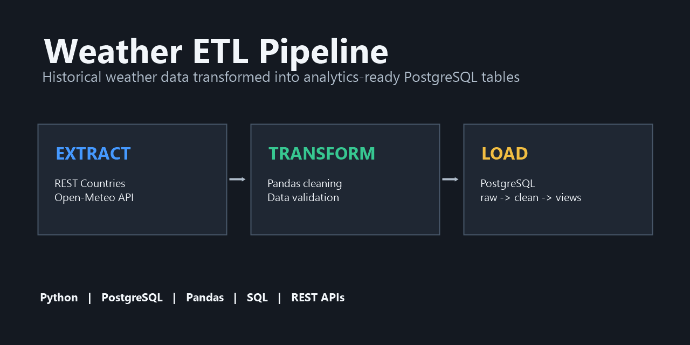
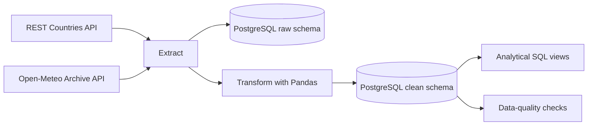

# Weather ETL Pipeline

An end-to-end Python ETL pipeline that collects the previous 30 complete days
of weather data for European capitals and loads analytics-ready data into
PostgreSQL.

The project combines country and capital information from the REST Countries
API with historical weather observations from the Open-Meteo Archive API.

## Tech stack

- Python 3.11+
- PostgreSQL
- Pandas
- Requests
- psycopg2

## Architecture



The `raw` schema preserves API-shaped records. The `clean` schema contains
validated relational data, converted units and foreign-key relationships. This
separation keeps source data available while providing a stable model for
analysis.

## Features

- Fetches European countries, capitals and capital coordinates.
- Collects 30 days of historical weather per capital.
- Removes countries without the fields required for weather extraction.
- Validates weather records and converts sunshine duration from seconds to hours.
- Stores source-shaped and cleaned data in separate PostgreSQL schemas.
- Creates analytical views for temperature, rainfall and country summaries.
- Runs row-count, null-value and value-range checks after loading.
- Keeps database credentials outside version control with environment variables.

## Project structure

```text
weather_etl_pipeline/
|-- db/
|   |-- schema.sql        # Schemas and tables
|   `-- views.sql         # Analytical views
|-- docs/
|   `-- social-preview.png
|-- tools/
|   `-- create_social_preview.ps1
|-- utils/
|   |-- extract.py        # External API requests
|   |-- transform.py      # Pandas transformations
|   |-- load.py           # PostgreSQL loading
|   |-- verify.py         # Data-quality checks
|   `-- views.py          # Example analytical output
|-- .env.example
|-- dump.sql              # Optional PostgreSQL schema dump
|-- main.py               # Pipeline entry point
`-- requirements.txt
```

## Setup

### 1. Prerequisites

Install:

- Python 3.11 or newer
- PostgreSQL
- Git
- A free [REST Countries API key](https://restcountries.com/sign-up)

Check that the commands are available:

```bash
python --version
psql --version
git --version
```

On some systems the Python command is `python3` instead of `python`.

### 2. Clone the repository

```bash
git clone https://github.com/UlmM35/weather_etl_pipeline.git
cd weather_etl_pipeline
```

### 3. Create and activate a virtual environment

Windows PowerShell:

```powershell
python -m venv .venv
.venv\Scripts\Activate.ps1
```

macOS or Linux:

```bash
python3 -m venv .venv
source .venv/bin/activate
```

### 4. Install dependencies

```bash
python -m pip install -r requirements.txt
```

Use `python3 -m pip` if your system uses the `python3` command.

### 5. Create the PostgreSQL database

Standard password-based connection:

```bash
createdb -h localhost -U postgres weather_etl
```

On Linux, a local PostgreSQL installation may use peer authentication instead:

```bash
sudo -u postgres createdb weather_etl
```

### 6. Create the schemas, tables and views

```bash
psql -h localhost -U postgres -d weather_etl -f db/schema.sql
psql -h localhost -U postgres -d weather_etl -f db/views.sql
```

The first command creates the `raw` and `clean` schemas and their tables. The
second command creates the analytical views used after the pipeline finishes.

As an alternative, `dump.sql` can initialize an empty database in one command:

```bash
psql -h localhost -U postgres -d weather_etl -f dump.sql
```

Do not run both initialization methods against the same database.

### 7. Configure environment variables

Windows PowerShell:

```powershell
Copy-Item .env.example .env
```

macOS or Linux:

```bash
cp .env.example .env
```

Open `.env` and replace the example password:

```dotenv
REST_COUNTRIES_API_KEY=your_rest_countries_api_key

DB_HOST=localhost
DB_PORT=5432
DB_NAME=weather_etl
DB_USER=postgres
DB_PASSWORD=your_postgresql_password
```

The `.env` file is ignored by Git and must not be committed.

REST Countries v5 requires an API key. Create an account, copy a key from the
REST Countries dashboard and place it in `REST_COUNTRIES_API_KEY`. The key is
sent in the `Authorization` request header and is never written to PostgreSQL.

## Run the pipeline

```bash
python main.py
```

The pipeline performs these steps:

1. Fetches and validates country data.
2. Fetches weather data for capitals with valid coordinates.
3. Transforms weather records and converts sunshine seconds to hours.
4. Clears the previous database contents only after fresh data is available.
5. Loads raw and cleaned data into PostgreSQL.
6. Runs data-quality checks.
7. Prints results from the analytical views.

Every successful run replaces the previous dataset so that the database always
represents one consistent 30-day period.

## Database model

| Schema | Table | Purpose |
| --- | --- | --- |
| `raw` | `countries` | Country data in its source-oriented form |
| `raw` | `weather` | Daily weather data returned by the API |
| `clean` | `countries` | Validated countries with generated IDs |
| `clean` | `weather` | Validated weather linked to countries by foreign key |

The clean weather table stores sunshine as hours in `sunshine_hours`. Raw API
records retain `sunshine_duration` in seconds.

## Analytical views

- `clean.v_capitals_by_avg_temp`: capitals ranked by average temperature.
- `clean.v_countries_by_rainfall`: countries ranked by total precipitation.
- `clean.v_country_summary`: 30-day temperature, rainfall, wind and sunshine
  summary for every country.

Example query:

```sql
SELECT *
FROM clean.v_countries_by_rainfall
LIMIT 10;
```

## Example validation output

```text
[PASS] clean country count does not exceed raw count
[PASS] clean weather count does not exceed raw count
[PASS] required country fields contain no null values
[PASS] temperature values are within a plausible range
[PASS] sunshine duration is between 0 and 24 hours
```

## Troubleshooting

### `psql` or `createdb` is not recognized

Add PostgreSQL's `bin` directory to your system PATH, or run the command from
that directory.

### PostgreSQL authentication fails

Check `DB_USER` and `DB_PASSWORD` in `.env`. On Linux, use the peer-authentication
database creation command shown above, then configure a password for the user
used by the application.

### REST Countries authentication fails

Check that `REST_COUNTRIES_API_KEY` exists in `.env` and contains an active API
key. The pipeline reports the API status code and error message without printing
the key.

### Relation or schema does not exist

Run `db/schema.sql` and `db/views.sql` against the same database configured in
`.env`.

## Data sources

- [REST Countries v5 API](https://restcountries.com/docs/countries)
- [Open-Meteo Historical Weather API](https://open-meteo.com/en/docs/historical-weather-api)
